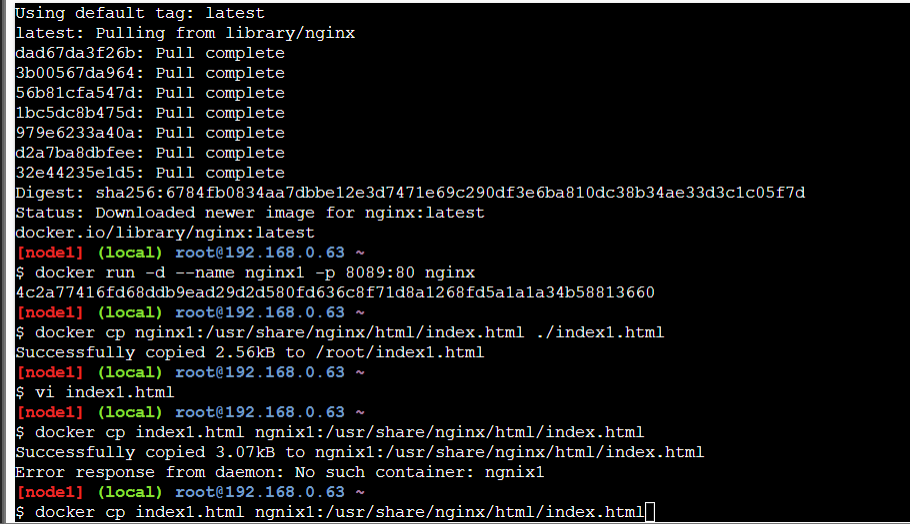

# Practica Comandos en Play with Docker
## 1. Titulo
**Practica No 2**: Introducción a Docker y uso de comandos básicos en contenedores
## 2. Tiempo de duración
Aproximadamente 2 horas para la realización de esta práctica
## 3. Fundamentos:

En esta práctica, se aprenderán conceptos básicos de manejo de archivos y carpetas, redirección, concatenación, y eliminación en la terminal de **Play with Docker (PWD)**  que es una plataforma gratuita en línea que permite probar Docker sin necesidad de instalarlo en el equipo local. Esta herramienta crea entornos virtuales temporales que simulan una máquina Linux con Docker preinstalado.

Durante la práctica, se exploraron comandos esenciales de Docker desde el navegador, incluyendo la gestión de contenedores, imágenes y volúmenes. Se aprendió también a interactuar con contenedores en modo interactivo y a utilizar imágenes oficiales de Nginx.

Entre los comandos utilizados se encuentran:

- **`docker pull`**: Para obtener imágenes del Docker Hub.
    
- **`docker run`**: Para iniciar contenedores.
    
- **`docker cp`**: Para copiar archivos desde o hacia un contenedor.

## 4. Conocimientos previos.
   
Para realizar esta práctica es necesario tener conocimientos sobre Docker, que es una plataforma para gestionar contenedores, lo que permite ejecutar aplicaciones de manera aislada y eficiente. Según **Turnbull, J.** (2014), Docker facilita la creación y despliegue de aplicaciones, mejorando la portabilidad y escalabilidad.

También es importante conocer algunos comandos básicos de Linux, ya que Docker se ejecuta en este sistema. Comandos como `docker pull`, `docker run`, y `docker ps` son fundamentales para gestionar contenedores y trabajar con imágenes, como señala **Sánchez Anguix, V.** (2021).

Finalmente, se utiliza Play with Docker (PWD), una plataforma online que permite trabajar con Docker sin necesidad de instalarlo localmente, como menciona **Richardson, D.** (2019).

## 5. Objetivos a alcanzar
   
- Crear contenedores Nginx y exponer puertos para el acceso desde el navegador.
    
- Copiar y editar archivos de los contenedores.
    
- Comprender la manipulación de contenedores usando comandos de Docker.
  
## 6. Equipo necesario:
  
- Computador con Windows 11 Home
- Procesador: AMD Ryzen 5 3500U with Radeon Vega Mobile Gfx 2.10 GHz
- Memoria: 8 GB
- Conexión a Internet para el material de apoyo
- Sitio Play with Docker para ejecutar los comandos

## 7. Material de apoyo.
   
- Documentación oficial de Docker
- Videos y foros de la comunidad Docker
- Videos Material de Apoyo (EVA)
- Libro: _The Docker Book_ de James Turnbull
  
## 8. Procedimiento

**Paso 1:** Verificación de la versión de Docker y descarga de la imagen oficial de Nginx .

Figura 1. Comando **"docker  -v y pull"**.

imagenes/1.png

**Paso 2:** Creamos el primer contenedor Nginx (`nginx1`) ejecutando el siguiente comando para crear el contenedor y exponerlo en el puerto 8089.

Figura 2. Comando **"docker run "**.

**Paso 3:** Copiamos el archivo `index.html` del contenedor `nginx1` al sistema anfitrión. Para copiarlo desde el contenedor `nginx1`, se utilizó el siguiente comando:

Figura 3. Comando **"docker cp"**..

**Paso 4:** Se modificó el archivo `index1.html` con información institucional usando un editor como `vi`

Figura 4. Comando **"vi"**..

**Paso 5:** Una vez editado, se copió el archivo actualizado de nuevo al contenedor `nginx1` con el siguiente comando:

Figura 5. Comando **"docker cp index1.html "**.

**Paso 6:** Se ejecuto el puerto 8089 para verificar la modificación del html con la información institucional.

Figura 6. Ventana Navegador.

**Paso 7:** Creamos el segundo contenedor Nginx (`nginx2`) ejecutando el siguiente comando para crearlo y exponerlo en el puerto 8090

Figura 7. Comando **"docker run "**.

**Paso 8:** Copiamos el archivo `index.html` del contenedor `nginx2` al sistema. Para copiarlo desde el contenedor , se utilizó el siguiente comando:

Figura 8. Comando **"docker cp "**.

**Paso 9:** Se modificó el archivo `index2.html` con información personal del estudiante usando un editor como `vi`

Figura 9. Comando **"vi"**.

**Paso 10:** Editado correctamente se copia el archivo actualizado de nuevo al contenedor `nginx2` con el siguiente comando:

Figura 10. Comando **"cp"**.

**Paso 11:** Se ejecuta el puerto 8090 para verificar la modificación del html con la información personal.

Figura 11.  Segunda Ventana Navegador.

## 9. Resultados esperados:
    
La práctica me permitió ejecutar contenedores desde Docker Hub, también  a manejar el entorno Play with Docker, una herramienta en línea ideal para practicar sin necesidad de instalaciones locales.

Después de completar todos los pasos, logré levantar dos contenedores **Nginx** con puertos personalizados (8089 y 8090), uno para mostrar información institucional y otro con mis datos personales. Usé comandos para copiar el archivo `index.html` desde los contenedores hacia el entorno anfitrión, y los edité con información específica, y luego los volví a subir a su contenedor correspondiente.

El uso de Play with Docker facilitó la creación, modificación y gestión de contenedores sin complicaciones, lo que me ayudó a entender mejor la lógica de los servicios aislados, la gestión de puertos y el manejo básico de archivos en contenedores.

En resumen, fue una práctica útil para familiarizarse con el entorno de Docker y editar contenido dentro de contenedores en un entorno seguro y accesible en línea

## 10. Bibliografía

- Richardson, D. (2019). _Linux for beginners: A practical and comprehensive guide to learn the fundamentals of Linux operating system and command line_. Independently published.
    
- Sánchez Anguix, V. (2021). _Introducción a los sistemas operativos y la línea de comandos_. Universitat Politècnica de València.
    
- Turnbull, J. (2014). _The Docker book: Containerization is the new virtualization_. James Turnbull.
